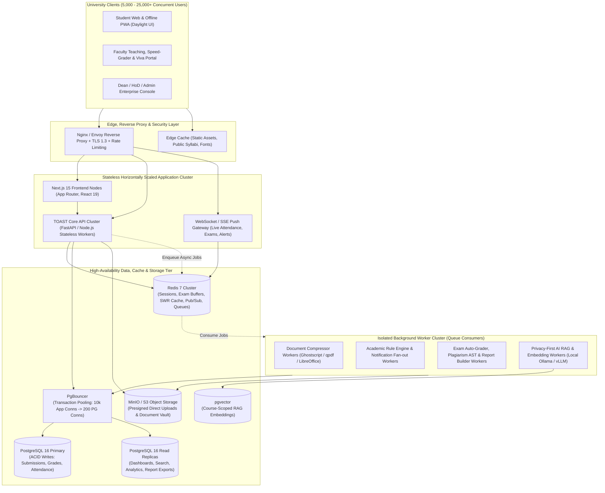
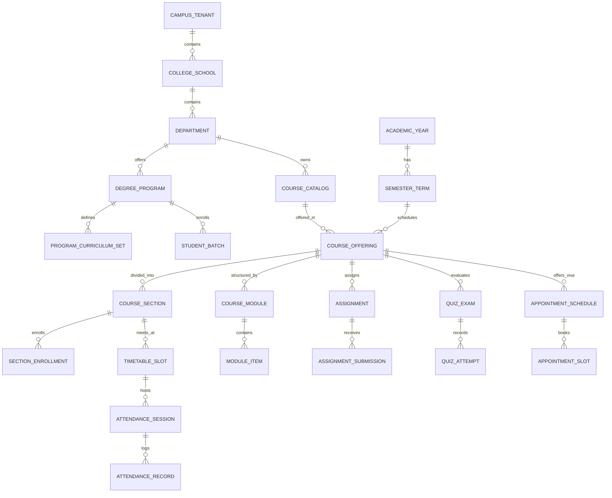
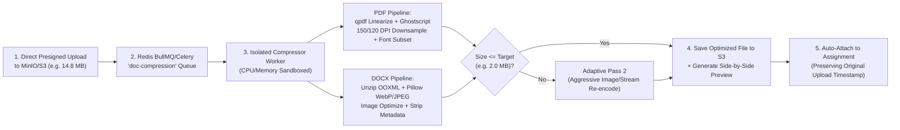

# TOAST — University-Scale Academic Operating System: Master Architecture & Engineering Plan

> **Document Purpose**: Definitive system architecture, database schema, REST/Realtime API specification, multi-user concurrency design (5,000–25,000+ concurrent users), Light-Themed Institutional UI Design System, and phased implementation blueprint for **TOAST (Teaching, Organization, Academics & Student Technology)**.

---

## 1. Executive Summary & Architectural Philosophy

**TOAST** is a standalone, next-generation **University Academic Operating System** engineered from the ground up on a pure modern distributed stack (`Next.js 15 + FastAPI / Node.js + PostgreSQL 16 + PgBouncer + Redis 7 + MinIO/S3`).

### Why Universities Need an Operating System (Not Just a File-Dump LMS)
1. **High-Concurrency Burst Readiness**: University traffic is defined by extreme synchronized spikes—thousands of students logging in at 8:55 AM for attendance, 2,000 students starting a mid-semester quiz at 10:00:00 AM sharp, and hundreds of students compressing and uploading PDFs at 11:58 PM before a deadline.
2. **Complete Academic & Institutional Lifecycle**: Beyond courses and assignments, a university requires formal organizational hierarchies (*Campuses $\rightarrow$ Colleges $\rightarrow$ Departments $\rightarrow$ Degree Programs $\rightarrow$ Batches $\rightarrow$ Sections*), 8-semester credit tracking, live timetable & attendance management, project viva & lab slot booking, automated governance rules, verifiable certificates, and Outcome-Based Education (OBE) accreditation reporting.
3. **Student Productivity & Daylight Ergonomics**: Designed around a high-contrast, glare-free **Light-Themed Institutional UI ("Daylight Academic")** that puts today's classes, attendance health margins, smart deadline breakdowns, an integrated `< 2 MB` PDF/DOCX compressor, and a course-grounded AI study copilot within a single click.

---

## 2. High-Concurrency Multi-User Server Architecture (5,000–25,000+ Users)



### 2.1 Technology Stack Specification

| Layer | Technology | Role in University Scale |
| :--- | :--- | :--- |
| **Frontend & PWA** | **Next.js 15 (App Router)**, React 19, TypeScript, Tailwind CSS v4, TanStack Query, Zustand, Radix UI | Server-rendered initial loads, instant client transitions, IndexedDB offline resource & exam answer caching, Light-Theme First design system. |
| **Core API Server** | **FastAPI (Python 3.12 Async)** / **Node.js (Fastify/NestJS)** with OpenAPI 3.1 | Stateless horizontally scalable REST API nodes handling authentication, RBAC, courses, enrollments, deadlines, and orchestration. |
| **Realtime Gateway** | **WebSockets (Socket.io / FastAPI WS) + Server-Sent Events (SSE)** backed by **Redis Pub/Sub** | Pushes live rotating attendance QR codes, synchronized exam countdowns, instant grade alerts, and viva slot locks to thousands of browsers. |
| **Primary Database** | **PostgreSQL 16** (Primary + Read Replicas) + **PgBouncer** (Transaction Pooling) | Strict ACID compliance for grades, submissions, and enrollments; Read Replicas offload heavy dashboard, search, and analytics queries. |
| **Cache & Message Broker** | **Redis 7 Cluster** + **BullMQ / Celery** | Sub-millisecond session validation, SWR dashboard cache, live exam answer buffering, distributed slot-booking locks, and worker job queues. |
| **Object Storage** | **MinIO (Self-Hosted S3-Compatible)** or **AWS S3 / Cloudflare R2** | Stores all lecture PDFs, student submissions, compressed documents, and certificate PDFs via zero-proxy presigned URLs. |
| **Document Engine** | Isolated Docker Workers running **Ghostscript**, **qpdf**, **LibreOffice Headless**, **Pillow/PyMuPDF** | High-efficiency server-side PDF & DOCX compression (`< 2 MB` target), thumbnail generation, and safe in-browser preview conversion. |
| **AI & Semantic Search** | **pgvector** + **Meilisearch / Postgres FTS** + **Modular LLM Gateway (Ollama / vLLM / OpenAI / Gemini)** | Privacy-first course RAG (students only query materials from courses they are enrolled in), PDF summarization, and `⌘K` instant search. |

### 2.2 Engineering for Peak University Concurrency

1. **9:00 AM Lecture Attendance Rush (5,000+ check-ins/minute)**:
   - Instructor starts a session $\rightarrow$ TOAST stores an active session state in Redis and broadcasts a rotating **10-second HMAC-SHA256 token** (rendered as a dynamic QR code on the classroom projector + 6-digit PIN).
   - Student check-in requests validate the HMAC token and student enrollment entirely in Redis (`< 2 ms`) using a Redis Set (`attendance:session:{id}:present`) to guarantee idempotency, then batch-insert records into PostgreSQL every 2 seconds.
2. **Synchronized Timed Exams (2,000+ concurrent test-takers)**:
   - Question banks and randomized per-student question orders are pre-computed and cached in Redis 15 minutes before exam start.
   - Student answer saves (`PUT /api/v1/attempts/:id/autosave`) write directly to a Redis Hash (`exam:attempt:{id}:answers`) in `< 5 ms` and enqueue a debounced background flush to PostgreSQL every 15 seconds.
   - Final submission (`POST /api/v1/attempts/:id/submit`) performs an atomic state transition and triggers the `exam-autograder` worker queue.
3. **11:59 PM Assignment Upload & Compression Stampede**:
   - Browser requests `POST /api/v1/files/presigned-upload` $\rightarrow$ Uploads file bytes directly to **MinIO/S3** without consuming API worker threads.
   - If the file exceeds the course limit (e.g., `14.2 MB` vs `2.0 MB` max) and the student clicks **"Auto-Compress & Submit"**, TOAST immediately records the `submitted_at` timestamp (preventing any late penalty) and places the file in the `doc-compression` queue. Isolated compressor workers optimize the PDF/DOCX and update the submission pointer upon completion.

---

## 3. Complete University Database Schema & ER Blueprint

TOAST uses a single, normalized PostgreSQL 16 schema with strict foreign-key integrity, composite indexes on high-traffic lookups, and JSONB columns for extensible metadata.



### 3.1 Core Table Definitions (PostgreSQL 16)

#### A. Institutional Hierarchy & Multi-Campus Governance
- `campus_tenants`: `id (UUID PK)`, `slug (UNIQUE)`, `name`, `domain`, `theme_config (JSONB — light palette overrides, logo_url)`, `storage_quota_bytes`, `created_at`
- `colleges`: `id`, `tenant_id (FK)`, `code`, `name`, `dean_user_id (FK)`
- `departments`: `id`, `college_id (FK)`, `code` (e.g., `CSE`, `ECE`), `name`, `hod_user_id (FK)`
- `academic_years`: `id`, `tenant_id (FK)`, `label` (e.g., `2026-2027`), `start_date`, `end_date`, `is_current`
- `semester_terms`: `id`, `academic_year_id (FK)`, `name` (e.g., `Odd Semester Fall 2026`), `term_number`, `start_date`, `end_date`, `enrollment_open_at`, `enrollment_close_at`

#### B. Users, Roles, Positions & Batches
- `users`: `id (UUID PK)`, `tenant_id (FK)`, `institutional_id` (Roll No / USN / Employee ID, indexed), `email (UNIQUE)`, `password_hash`, `full_name`, `avatar_url`, `primary_role` (`STUDENT`, `TA`, `FACULTY`, `HOD`, `DEAN`, `ADMIN`), `preferences (JSONB — theme: 'light'|'dark', notification_prefs)`, `is_active`, `last_login_at`
- `org_positions`: `id`, `user_id (FK)`, `department_id (FK)`, `position_title`, `reports_to_user_id (FK)`, `permissions_mask (JSONB)`
- `degree_programs`: `id`, `department_id (FK)`, `code` (e.g., `BTECH-CSE`), `name`, `duration_semesters` (`8`), `total_required_credits` (`160`), `grading_scale (JSONB)`
- `program_curriculum_sets`: `id`, `program_id (FK)`, `semester_number` (`1..8`), `set_type` (`CORE`, `DEPT_ELECTIVE`, `OPEN_ELECTIVE`), `min_credits_required`, `prerequisite_rules (JSONB)`
- `student_batches`: `id`, `program_id (FK)`, `admission_year` (`2024`), `graduation_year` (`2028`), `current_semester_number` (`5`), `faculty_advisor_id (FK)`
- `cohort_memberships`: `batch_id (FK)`, `student_user_id (FK)`

#### C. Courses, Sections, Enrollments & OBE Outcomes
- `course_catalog`: `id`, `department_id (FK)`, `course_code` (e.g., `CS-301`), `title` (`Compiler Design`), `credits` (`4.0`), `lecture_hours`, `tutorial_hours`, `practical_hours`, `is_shared_university_wide (BOOL)`, `prerequisites (UUID[])`
- `course_outcomes`: `id`, `course_catalog_id (FK)`, `co_code` (`CO1..CO6`), `description`, `bloom_taxonomy_level`, `po_mapping_weights (JSONB — PO1..PO12 weights)`
- `course_offerings`: `id`, `course_catalog_id (FK)`, `semester_term_id (FK)`, `coordinator_user_id (FK)`, `syllabus_json (JSONB)`, `attendance_min_pct` (`75.0`), `is_published`
- `course_sections`: `id`, `course_offering_id (FK)`, `section_code` (`Sec-A`, `Lab-B1`), `section_type` (`LECTURE`, `LAB`, `TUTORIAL`), `instructor_user_id (FK)`, `room_number`, `max_capacity`
- `section_enrollments`: `id`, `course_section_id (FK)`, `student_user_id (FK)`, `enrollment_status` (`ENROLLED`, `WAITLISTED`, `DROPPED`, `COMPLETED`), `final_grade_points`, `final_letter_grade`, `enrolled_at` *(Unique index on `course_section_id, student_user_id`)*

#### D. Syllabus Modules, Resources & Offline Sync
- `course_modules`: `id`, `course_offering_id (FK)`, `module_number`, `title`, `summary`, `unlock_at`, `sort_order`
- `module_items`: `id`, `course_module_id (FK)`, `item_type` (`DOCUMENT`, `VIDEO`, `LINK`, `ASSIGNMENT`, `QUIZ`, `NOTES`), `title`, `file_id (FK nullable)`, `external_url`, `is_offline_cacheable (BOOL)`, `estimated_minutes`, `sort_order`, `updated_at`
- `student_item_completions`: `student_user_id (FK)`, `module_item_id (FK)`, `completed_at`, `progress_pct`

#### E. Timetable, Live Attendance & Viva / Office-Hours Booking
- `timetable_slots`: `id`, `course_section_id (FK)`, `day_of_week` (`1..7`), `start_time`, `end_time`, `room_code`
- `attendance_sessions`: `id`, `course_section_id (FK)`, `timetable_slot_id (FK)`, `session_date`, `started_by_user_id (FK)`, `mode` (`QR_DYNAMIC`, `PIN_CODE`, `MANUAL`), `hmac_secret`, `allowed_ip_cidrs (TEXT[])`, `status` (`ACTIVE`, `CLOSED`), `expires_at`
- `attendance_records`: `id`, `attendance_session_id (FK)`, `student_user_id (FK)`, `status` (`PRESENT`, `ABSENT`, `LATE`, `EXCUSED`), `marked_at`, `client_ip`, `verification_method` *(Indexed by `student_user_id, attendance_session_id`)*
- `appointment_schedules`: `id`, `course_offering_id (FK)`, `host_user_id (FK)`, `title` (e.g., `Compiler Project Final Viva`), `purpose` (`VIVA`, `LAB_EVAL`, `OFFICE_HOURS`), `location_or_meet_url`, `slot_duration_mins` (`15`), `max_attendees_per_slot` (`1`)
- `appointment_slots`: `id`, `schedule_id (FK)`, `start_at`, `end_at`, `booked_by_user_id (FK nullable)`, `booked_team_id (FK nullable)`, `status` (`AVAILABLE`, `BOOKED`, `COMPLETED`, `NO_SHOW`), `evaluator_notes`

#### F. Smart Deadlines, Assignments, Quizzes & Gradebook
- `assignments`: `id`, `course_offering_id (FK)`, `section_id (FK nullable)`, `title`, `description_md`, `due_at`, `cutoff_at`, `late_penalty_per_day_pct`, `max_marks`, `weightage_pct`, `allowed_extensions (TEXT[])`, `max_file_size_mb` (`2.0`), `auto_compress_enabled (BOOL)`, `rubric_json (JSONB)`, `co_tags (TEXT[])`
- `student_deadline_tasks`: `id`, `student_user_id (FK)`, `source_type` (`ASSIGNMENT`, `QUIZ`, `VIVA`, `PERSONAL`), `source_id (UUID)`, `custom_priority_score (FLOAT)`, `self_reported_progress_pct` (`0..100`), `subtasks_json (JSONB)`, `snoozed_until`
- `assignment_submissions`: `id`, `assignment_id (FK)`, `student_user_id (FK)`, `file_id (FK)`, `compressed_file_id (FK nullable)`, `submitted_at` *(locked at upload start)*, `is_late (BOOL)`, `status` (`UPLOADED`, `COMPRESSING`, `SUBMITTED`, `GRADED`), `similarity_score_pct`, `marks_awarded`, `rubric_breakdown_json (JSONB)`, `feedback_text`, `graded_by_user_id (FK)`, `graded_at`
- `question_bank_items`: `id`, `course_catalog_id (FK)`, `question_type` (`MCQ_SINGLE`, `MCQ_MULTI`, `NUMERICAL`, `SHORT_TEXT`, `CODE`), `prompt_md_latex`, `options_json (JSONB)`, `correct_answer_json (JSONB)`, `marks`, `negative_marks`, `difficulty` (`1..5`), `co_code`
- `quizzes`: `id`, `course_offering_id (FK)`, `title`, `opens_at`, `closes_at`, `duration_minutes`, `max_marks`, `shuffle_questions (BOOL)`, `require_fullscreen (BOOL)`, `allowed_lab_subnets (TEXT[])`, `question_selection_rules (JSONB)`
- `quiz_attempts`: `id`, `quiz_id (FK)`, `student_user_id (FK)`, `started_at`, `submitted_at`, `status` (`IN_PROGRESS`, `SUBMITTED`, `AUTO_SUBMITTED`, `EVALUATED`), `question_order (UUID[])`, `answers_json (JSONB)`, `focus_violation_count (INT)`, `telemetry_log (JSONB)`, `total_score`

#### G. Document Vault & Server-Side Compressor
- `files`: `id (UUID PK)`, `owner_user_id (FK)`, `tenant_id (FK)`, `bucket_name`, `object_key`, `original_filename`, `mime_type`, `size_bytes`, `sha256_hash`, `malware_scan_status` (`PENDING`, `CLEAN`, `QUARANTINED`), `created_at`
- `compression_jobs`: `id (UUID PK)`, `user_id (FK)`, `source_file_id (FK)`, `output_file_id (FK nullable)`, `file_format` (`PDF`, `DOCX`), `target_size_bytes` (`2097152` for 2 MB), `preset` (`HIGH_QUALITY`, `BALANCED`, `MAX_COMPRESSION`), `original_size_bytes`, `compressed_size_bytes`, `reduction_pct`, `status` (`QUEUED`, `PROCESSING`, `COMPLETED`, `FAILED`), `duration_ms`, `created_at`

#### H. Dynamic Automation Rules, Verifiable Certificates, AI RAG & Alien Run
- `automation_rules`: `id`, `tenant_id (FK)`, `name`, `trigger_event` (`ATTENDANCE_UPDATED`, `ASSIGNMENT_OVERDUE`, `COURSE_COMPLETED`, `SEMESTER_PROMOTED`), `conditions_json (JSONB)`, `actions_json (JSONB)`, `is_enabled (BOOL)`, `last_triggered_at`
- `issued_certificates`: `id`, `user_id (FK)`, `course_offering_id (FK nullable)`, `program_id (FK nullable)`, `certificate_type` (`COURSE_COMPLETION`, `LAB_SAFETY_CERTIFICATION`, `DEANS_LIST`, `ACHIEVEMENT`), `verification_hash (UNIQUE)`, `pdf_file_id (FK)`, `issued_at`, `expires_at (nullable)`
- `rag_document_chunks`: `id`, `course_offering_id (FK)`, `file_id (FK)`, `page_or_slide_number`, `chunk_text`, `embedding (vector(1536))` *(HNSW index for `< 10ms` cosine similarity)*
- `xp_ledger`: `id`, `student_user_id (FK)`, `event_type` (`ASSIGNMENT_ON_TIME`, `QUIZ_PASSED`, `DAILY_STREAK`, `ATTENDANCE_WEEK_100`), `xp_delta (INT)`, `reference_id (UUID)`, `created_at`
- `alien_run_profiles`: `student_user_id (PK FK)`, `total_xp (BIGINT)`, `current_level (INT)`, `current_streak_days (INT)`, `longest_streak_days (INT)`, `world_stage (INT)`, `unlocked_cosmetics (JSONB)`, `updated_at`

---

## 4. Complete TOAST Native REST & Realtime API Catalog (`/api/v1/...`)

All endpoints return consistent JSON envelopes (`{ "data": ..., "meta": ... }`), enforce RBAC & tenant scoping via middleware, and publish OpenAPI 3.1 schemas.

### 4.1 System, Auth & Organization Endpoints
| Method & Path | Description | Concurrency / Caching Strategy |
| :--- | :--- | :--- |
| `GET /api/v1/system/bootstrap` | Returns current user, role permissions, active semester, campus light-theme tokens, and unread counts. | Cached in Redis per user (`TTL 300s`, event-invalidated). |
| `POST /api/v1/auth/login` | Institutional email/roll-number login + HttpOnly JWT & Redis session creation. | Rate-limited per IP & account via Redis sliding window. |
| `GET /api/v1/auth/sso/:provider` | University OIDC / SAML 2.0 / Google Workspace / Microsoft Entra ID login. | Stateless PKCE state in Redis. |
| `POST /api/v1/auth/qr-session` | Instant passwordless QR login for university computer lab workstations. | Short-lived 60s single-use token in Redis. |
| `GET /api/v1/org/hierarchy` | Returns Campus $\rightarrow$ College $\rightarrow$ Department $\rightarrow$ Program tree. | Cached in Redis (`TTL 1h`), read from Replica. |
| `POST /api/v1/users/bulk-provision` | Admin CSV/SIS bulk import of students, batches, and enrollments. | Queued via `bulk-provisioning` worker; streams progress via SSE. |

### 4.2 Curriculum, Courses, Syllabus & Enrolment Endpoints
| Method & Path | Description | Concurrency / Caching Strategy |
| :--- | :--- | :--- |
| `GET /api/v1/programs/:id/curriculum` | Returns 8-semester degree map, core/elective credit buckets, and student completion status. | Read Replica + SWR Redis cache. |
| `GET /api/v1/courses` | Lists enrolled courses for Student or taught courses for Faculty in the active semester. | Cached per user-semester in Redis. |
| `GET /api/v1/courses/:id/syllabus-tree` | Returns all modules, items, lecture PDFs, completion badges, and OBE `CO` tags. | ETag + Redis cache (`course:tree:{id}`), supports offline PWA sync. |
| `POST /api/v1/courses/:id/modules` | Faculty creates/updates/reorders course modules and attaches files. | Invalidates `course:tree:{id}` cache & triggers AI RAG indexing job. |
| `POST /api/v1/enrollments/elective-bid` | High-speed university elective registration with prerequisite & seat capacity checks. | Uses **Redis Lua atomic seat decrement** so 5,000 students bidding simultaneously never overbook a 60-seat elective. |

### 4.3 Timetable, Live Attendance & Viva Booking Endpoints
| Method & Path | Description | Concurrency / Caching Strategy |
| :--- | :--- | :--- |
| `GET /api/v1/timetable/my-schedule` | Returns merged weekly lecture/lab timetable + today's live session status + upcoming viva slots. | Cached in Redis; live session state merged in `< 5 ms`. |
| `POST /api/v1/attendance/sessions/start` | Faculty starts live attendance; returns rotating 10s HMAC QR stream URL & 6-digit PIN. | Creates Redis session state & broadcasts via WebSocket room. |
| `POST /api/v1/attendance/sessions/:id/check-in` | Student checks in via QR/PIN (validates campus subnet if required). | **100% in-memory Redis validation** + async 2s batch insert to Postgres. |
| `GET /api/v1/users/me/attendance-health` | Returns per-course attendance %, safe-bunk margin, or exact classes needed to reach 75%. | Computed on Read Replica and cached in Redis. |
| `GET /api/v1/appointments/schedules/:id/slots` | Lists available & booked Viva / Lab Evaluation / Office-Hour slots. | Real-time slot availability via Redis + SSE. |
| `POST /api/v1/appointments/slots/:slotId/book` | Student or project team books a viva slot. | **Redis `SET NX` distributed lock** prevents double-booking. |

### 4.4 Smart Deadlines, Assignments & Speed-Grader Endpoints
| Method & Path | Description | Concurrency / Caching Strategy |
| :--- | :--- | :--- |
| `GET /api/v1/deadlines/smart-queue` | Returns prioritized deadlines ranked by `Urgency × Credit Weight × (1 - Progress%)` with suggested daily milestones. | Read Replica + Redis cache. |
| `PATCH /api/v1/deadlines/:id/progress` | Updates student's personal progress slider (`0%–100%`) and checklist items. | Fast write + updates dashboard SWR cache. |
| `POST /api/v1/courses/:id/assignments` | Faculty creates assignment with rubric JSON, file constraints, and `CO` outcome tags. | Enqueues deadline notifications & calendar events via worker. |
| `POST /api/v1/assignments/:id/submit` | Confirms student submission (with optional `auto_compress_to_mb: 2.0`). | Locks `submitted_at` timestamp immediately; queues compression & AST similarity check. |
| `POST /api/v1/assignments/:id/grades/bulk` | Faculty submits rubric scores & feedback; triggers XP award and grade notification. | Transactional batch update + async notification fan-out. |

### 4.5 High-Concurrency Timed Quizzes & Gradebook Endpoints
| Method & Path | Description | Concurrency / Caching Strategy |
| :--- | :--- | :--- |
| `POST /api/v1/courses/:id/question-bank` | Faculty creates/imports MCQ, numerical, LaTeX, or coding questions tagged with `CO1–CO6`. | Stored in Postgres; pre-warmed to Redis before scheduled exams. |
| `POST /api/v1/quizzes/:id/attempts/start` | Starts timed attempt; returns deterministic randomized question payload & server clock sync. | Served from pre-warmed Redis exam cache (`< 10 ms`). |
| `PUT /api/v1/attempts/:attemptId/autosave` | Saves student answer selection & focus telemetry during live exam. | **Writes to Redis Hash (`< 5 ms`)**; background worker flushes to Postgres every 15s. |
| `POST /api/v1/attempts/:attemptId/submit` | Finalizes attempt and enqueues instant objective auto-grading. | Atomic state lock in Redis + Postgres write. |
| `GET /api/v1/users/me/transcript` | Returns semester-wise Gradebook, SGPA, cumulative CGPA, and earned credits. | Read Replica. |

### 4.6 Document Studio & Server-Side PDF/DOCX Compressor Endpoints
| Method & Path | Description | Concurrency / Caching Strategy |
| :--- | :--- | :--- |
| `POST /api/v1/files/presigned-upload` | Generates short-lived MinIO/S3 presigned `PUT` URL for direct browser-to-storage upload. | Zero file-byte load on API servers. |
| `POST /api/v1/documents/compress` | Enqueues a PDF or DOCX compression job targeting `< 2 MB` (or custom size). | Isolated `toast-doc-worker` pool; streams live progress via SSE. |
| `GET /api/v1/documents/compress/:jobId` | Returns compression status, original vs. compressed size, % saved, and preview/download URLs. | Polled or pushed via `/api/v1/realtime/stream`. |

### 4.7 AI Course Intelligence, Automation, Reports & Alien Run Endpoints
| Method & Path | Description | Concurrency / Caching Strategy |
| :--- | :--- | :--- |
| `GET /api/v1/search/global?q=...` | `⌘K` instant search across enrolled courses, PDFs, slides, assignments, and announcements. | Sub-20ms indexed search scoped strictly to user's enrolled courses. |
| `POST /api/v1/ai/course-copilot` | Streaming RAG chat grounded strictly in the student's enrolled course materials with page citations. | Vector similarity on `pgvector` + SSE token streaming. |
| `POST /api/v1/ai/faculty/draft-assessment` | Generates draft quiz questions or assignment rubrics from a lecture PDF for faculty review. | Async AI worker queue. |
| `POST /api/v1/automation/rules` | Admin/HoD creates *"When [Trigger] + If [Condition] → Execute [Action]"* institutional rules. | Evaluated asynchronously by `toast-rule-worker`. |
| `POST /api/v1/reports/export` | Generates custom Department / Attendance / OBE Attainment reports in CSV, XLSX, or PDF. | Background report worker + downloadable presigned URL. |
| `GET /api/v1/certificates/verify/:hash` | Public cryptographic verification of any TOAST-issued course or skill certificate. | Fast indexed lookup on `verification_hash`. |
| `GET /api/v1/alien-run/state` | Fetches student's XP, level, streak, and Alien Run world progression state. | Cached in Redis; isolated from critical exam/submission paths. |

---

## 5. Server-Side PDF & DOCX Compressor Architecture

Universities routinely enforce strict `< 2 MB` or `< 5 MB` upload limits on assignment portals to conserve storage, forcing students to use shady third-party ad-ridden PDF compressor websites before submitting homework. TOAST builds this utility **directly into the platform and submission workflow**.



---

## 6. Institutional Light-Themed UI Design System ("Daylight Academic")

### 6.1 Design Principles
1. **Daylight Readability First**: High-contrast dark slate ink (`#0F172A`) on a calm warm-cool paper canvas (`#F8FAFC`) with crisp pure-white cards (`#FFFFFF`) and `1px solid #E2E8F0` borders.
2. **Maximum 2 Clicks to Any Academic Action**:
   - Mark today's attendance: **1 click** from Dashboard.
   - Compress & submit an assignment: **2 clicks** from Smart Deadline card.
   - Book a project viva slot: **2 clicks** from Course page.
   - Search any syllabus topic or PDF: **`⌘K / Ctrl+K`** from anywhere.
3. **Tabular Precision**: All numbers—grades, CGPA, attendance percentages, countdown timers, and file sizes—use `JetBrains Mono` with `font-variant-numeric: tabular-nums`.

### 6.2 Role-Based Screen Inventory
* **Public & Auth Screens**: University Campus Portal, SSO / Roll-Number Login, Lab QR Login, Public Certificate Verification Page (`/verify/:hash`).
* **Student Workspace**:
  1. **Command Dashboard** (KPI strip, Today's Timetable + Live Check-In, Smart Deadline Queue, AI Copilot bar)
  2. **My Courses & Degree Map** (Active semester cards + 8-semester curriculum credit tracker)
  3. **Course Workspace** (Collapsible module tree, embedded PDF/slide viewer with AI summary sidebar, discussions, viva slot booking)
  4. **Smart Deadlines & Task Board** (Kanban / Priority queue with progress sliders and milestone breakdowns)
  5. **Document Studio & Compressor** (Drag-and-drop `< 2 MB` PDF/DOCX compressor with before/after visual quality preview & offline file vault)
  6. **Timed Exam Interface** (Distraction-free light theme, sticky question palette, live Redis autosave indicator, timer)
  7. **Academic Analytics & Transcript** (Attendance safe-bunk calculator, SGPA/CGPA simulator, CO attainment radar)
  8. **Alien Run Hub** (XP ledger, streak calendar, section leaderboard, interactive Alien Run world canvas)
* **Faculty Workspace**:
  1. **Teaching Command Center** (Today's classes, 1-click Live QR Attendance projector view, pending grading queue)
  2. **Speed-Grader Studio** (Split-screen submission preview + interactive rubric clicker + similarity report)
  3. **Course, Assignment & Quiz Authoring Studio** (With AI quiz/rubric generator & OBE `CO` tagging)
  4. **Viva & Office-Hours Scheduler** (Publish time blocks, view live bookings, mark evaluation scores)
  5. **Section Analytics & At-Risk Watchlist** (Automated flags for students `< 75%` attendance or missing deadlines)
* **HoD / Dean / Admin Console**:
  1. **Department & Campus Overview** (Live attendance heatmaps, pass/fail distributions, faculty grading SLAs)
  2. **Dynamic Automation Rules Builder** (Visual *"When [Event] + If [Condition] → Then [Action]"* studio)
  3. **OBE Accreditation & Custom Report Builder** (CO-PO matrices, scheduled CSV/XLSX/PDF exports)
  4. **SIS Bulk Provisioning & Server Queue Monitor** (Users, batches, storage quotas, worker health)

---

## 7. Monorepo Structure & Deployment Topology

```text
toast/
├── README.md
├── TOAST.txt
├── TOAST_UNIVERSITY_PLATFORM_PLAN.md
├── docker-compose.yml                 # Full local & single-node university stack
├── docker-compose.prod.yml            # Horizontally scaled production stack
├── infra/
│   ├── nginx/                         # Reverse proxy, TLS, rate-limiting & SSE config
│   ├── pgbouncer/                     # Transaction pooling configuration
│   └── postgres/                      # Init scripts, pgvector extension, backup cron
├── apps/
│   ├── web/                           # Next.js 15 Light-Themed University UI & PWA
│   │   ├── src/app/
│   │   │   ├── (auth)/                # Login, SSO, Lab QR Login
│   │   │   ├── (student)/             # Dashboard, Courses, Deadlines, Compressor, Exam, Alien Run
│   │   │   ├── (faculty)/             # Live Attendance, Speed-Grader, Quiz Studio, Viva Slots
│   │   │   └── (governance)/          # HoD, Dean & Admin Enterprise Console
│   │   ├── src/components/            # Daylight Academic UI Design System components
│   │   └── src/lib/                   # API client, SSE hooks, IndexedDB offline sync
│   ├── api/                           # TOAST Core REST & Realtime Server
│   │   ├── src/modules/
│   │   │   ├── auth/                  # JWT, OIDC/SAML SSO, RBAC middleware
│   │   │   ├── org/                   # Campuses, Departments, Degree Programs, Batches
│   │   │   ├── courses/               # Offerings, Sections, Syllabus Tree, Elective Bidding
│   │   │   ├── attendance/            # Rotating HMAC QR/PIN engine & Redis stream consumer
│   │   │   ├── deadlines/             # Smart Deadline Priority Engine
│   │   │   ├── assignments/           # Submissions, Rubrics, Speed-Grader API
│   │   │   ├── quizzes/               # Question Bank, Redis-buffered Live Exam Engine
│   │   │   ├── appointments/          # Viva, Lab & Office-Hour Slot Booking
│   │   │   ├── documents/             # Presigned S3 Vault & Compressor Job API
│   │   │   ├── automation/            # Dynamic If-This-Then-That Rules Engine
│   │   │   ├── analytics/             # At-Risk Detection, OBE CO-PO, Report Builder
│   │   │   ├── ai/                    # Course-Scoped RAG & Faculty Copilot
│   │   │   └── gamification/          # Event-driven XP Ledger, Badges & Alien Run
│   └── workers/                       # Isolated Background Worker Services
│       ├── doc-compressor/            # Ghostscript, qpdf, LibreOffice, Pillow pipeline
│       ├── ai-rag-indexer/            # PDF chunking, embeddings & local/cloud LLM worker
│       └── rules-and-reports/         # Dynamic rules evaluation, email/push & XLSX/PDF exports
└── packages/
    ├── database/                      # PostgreSQL schema migrations & seeders
    └── shared-types/                  # OpenAPI schemas & shared TypeScript/Python contracts
```

---

## 8. Phased Implementation Roadmap

### Phase 0 — Server & Database Foundation
- Set up monorepo (`apps/web`, `apps/api`, `apps/workers`, `packages/database`).
- Configure `docker-compose.yml` with **PostgreSQL 16 (`pgvector`)**, **PgBouncer**, **Redis 7**, **MinIO (S3)**, and **Nginx**.
- Implement the core PostgreSQL schema migrations and seed a realistic university dataset (e.g., *School of Engineering $\rightarrow$ CSE Department $\rightarrow$ B.Tech Sem 5 courses, faculty, and students*).
- Implement JWT + University SSO authentication and role-based access control (`STUDENT`, `FACULTY`, `HOD`, `ADMIN`).

### Phase 1 — Daylight Academic UI & Core University Workflows
- Build the **Light-Themed Institutional UI Design System** (`#F8FAFC` canvas, `#FFFFFF` surfaces, `#1D4ED8` academic blue accent, `Command+K` global palette, dark-mode toggle).
- Build the **Student Command Dashboard**, **Faculty Teaching Center**, and **Admin/HoD Console**.
- Implement **Course Offerings, Syllabus Modules**, **Weekly Timetable**, and **Live Rotating QR/PIN Classroom Attendance**.

### Phase 2 — Smart Deadlines, Assignments & Built-In PDF/DOCX Compressor
- Build the **Smart Deadline Priority Queue** with student progress sliders and milestone breakdowns.
- Implement **Zero-Proxy Presigned S3 Uploads** and the **Server-Side PDF/DOCX Compressor Worker** (`< 2 MB` target with before/after preview and lock-in submission timestamps).
- Build the **Faculty Split-Screen Speed Grader** with interactive rubrics.

### Phase 3 — High-Concurrency Timed Exams, Viva Booking & Gradebook
- Implement the **Question Bank** and **Redis-Buffered Live Timed Quiz Engine** capable of handling 2,000+ simultaneous exam takers with `< 10 ms` answer autosave.
- Build the **Viva, Lab Evaluation & Office-Hours Slot Booking** module with Redis distributed locks.
- Build the **Credit-Weighted SGPA/CGPA Gradebook** and curve simulator.

### Phase 4 — Institutional Automation, Certificates, OBE & Analytics
- Build the **Dynamic Rules Engine** (*"When [Event] + If [Condition] → Execute [Action]"*).
- Implement **Predictive At-Risk Student Detection** (attendance + deadline velocity), **OBE CO-PO Attainment Matrices**, **Custom Report Builder**, and **QR-Verifiable PDF Certificates**.

### Phase 5 — Privacy-First AI Course Intelligence & Global Search
- Implement the **Course-Scoped RAG Pipeline** (`pgvector`), **AI Study Copilot**, **One-Click Lecture PDF Summarizer**, **Faculty Quiz/Rubric Drafter**, and **`⌘K` Global Semantic Search**.

### Phase 6 — Gamification & Alien Run
- Implement the event-driven **Academic XP Ledger**, learning streaks, verifiable badges, section leaderboards, and the optional **Alien Run** interactive progression world.
